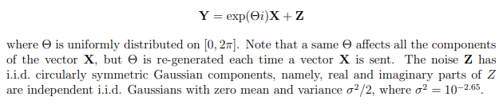

# QAM modulation for complex AWGN communication

Transmission of a message over a complex AGWN channel with the following characteristics :



`numpy` and `jellyfish` are required to run the script : `pip install numpy jellyfish`.

The program can be ran using the following command :

```sh
python main.py --srv --n=1 --m=64
```

In the above command the values used for `--n` and `--m` are the default ones, when `--srv` is set the channel used is the one on the EPFL server (VPN required) otherwise it uses a simulated channel locally, the `--n` argument allows you to run the transmission multiple times and get an average difference and the `--m` argument is there to choose the number of points in the QAM constellation.